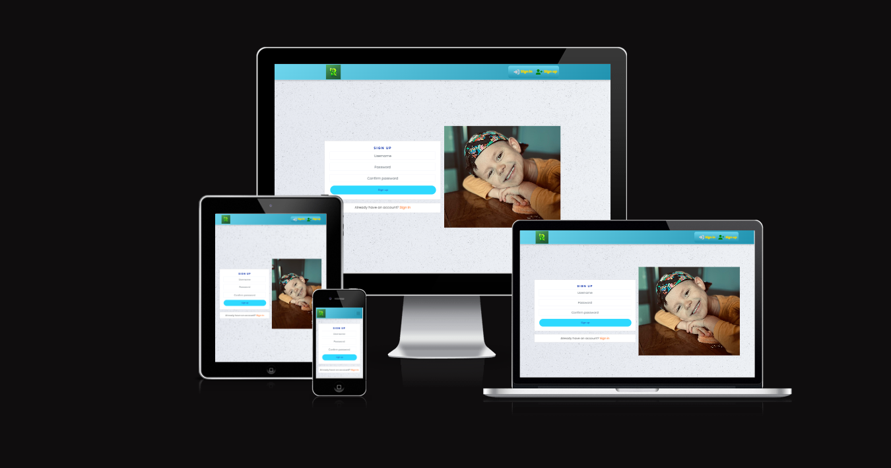
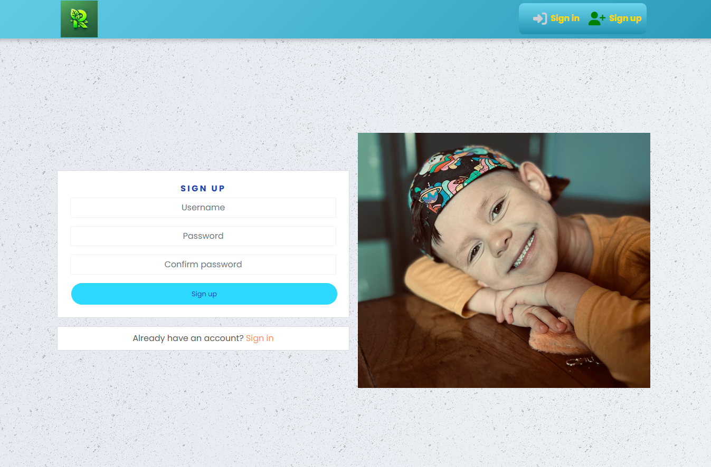
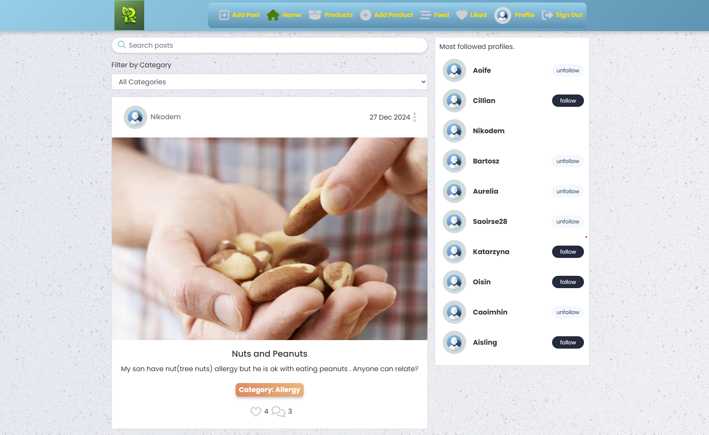
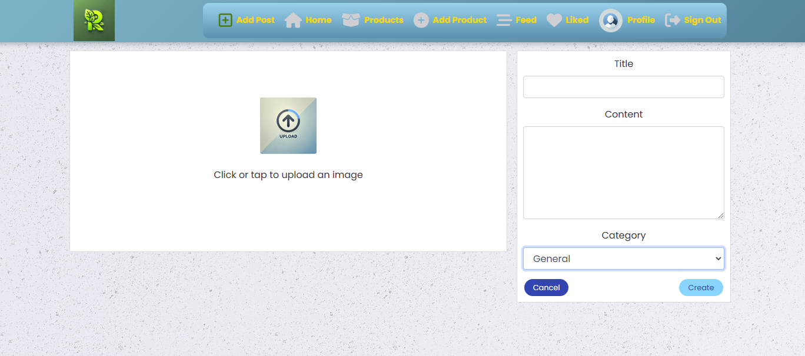
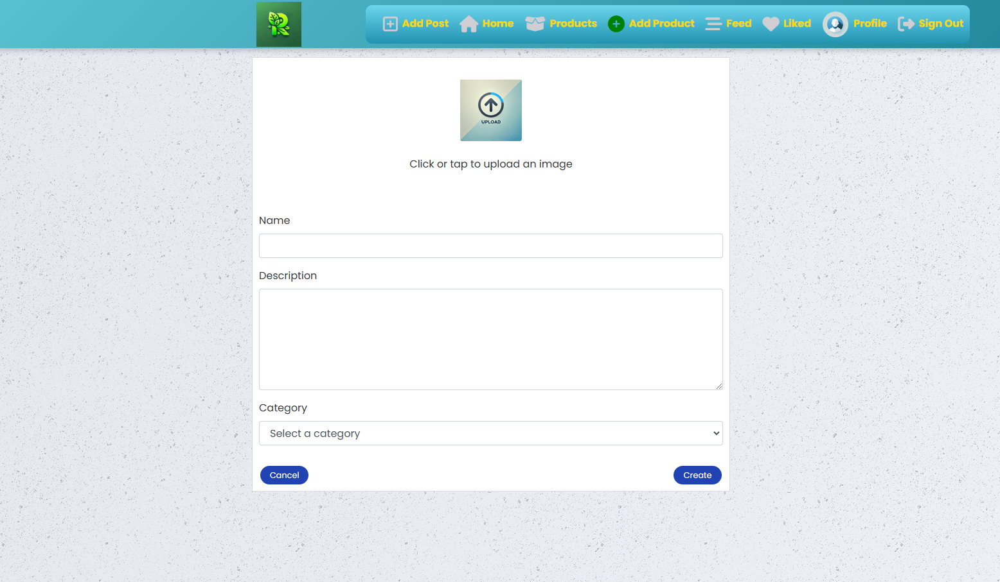
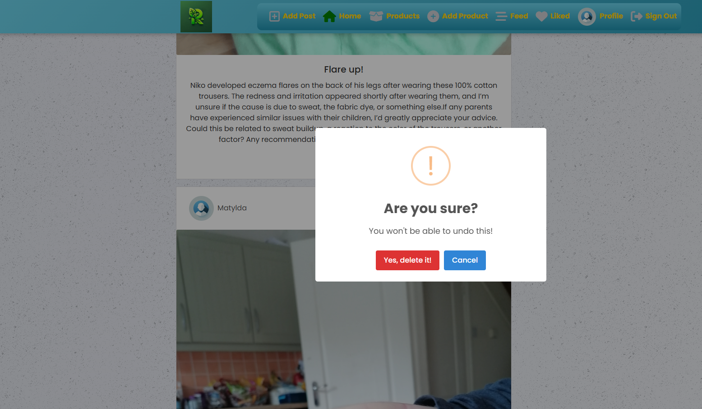
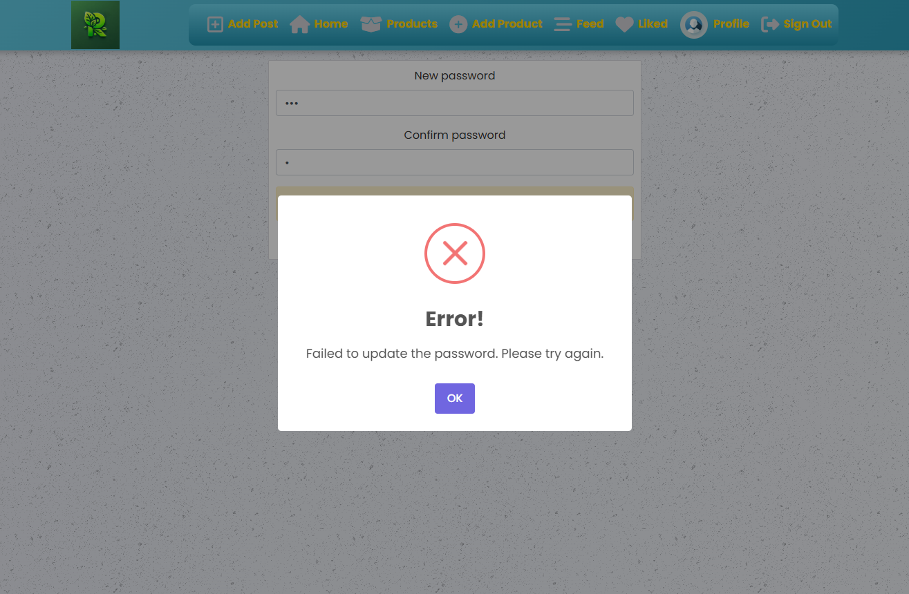

# 🌿 Remeskin - Social Media Platform for Skin Issues and Allergies

## Table of Contents

- [📘 Introduction](#-introduction)
- [📱 Fully Responsive Design](#-fully-responsive-design)
- [🌟 Features](#-features)
- [🛠️ Technologies](#️-technologies)
- [📱 PWA Support](#-pwa-support)
- [🗂️ Project Management](#-project-management)
- [⚙️ Installation and Setup](#️-installation-and-setup)
- [📁 Project Structure](#-project-structure)
- [🖼️ Screenshots](#️-screenshots)
- [✅ Testing](#-testing)
- [🚀 Frontend Deployment](#-frontend-deployment)
- [🌍 Live Demo](#-live-demo)
- [🔮 Future Plans](#-future-plans)
- [🤝 Contributing](#-contributing)
- [👤 Author](#-author)

## 📘 Introduction
[Remeskin](https://remeskin-00de58d1deef.herokuapp.com/) is a social media platform designed to support individuals dealing with skin conditions like eczema and allergies, including nut allergies. The goal is to create a community where users can share experiences, seek advice, post images of symptoms, and discuss products that help them manage these conditions. Remeskin aims to reduce isolation and helplessness by providing a supportive space for people facing similar challenges.

## 📱 Fully Responsive Design
Remeskin is designed with a fully responsive layout, ensuring an optimal user experience across various devices and screen sizes, including desktops, tablets, and smartphones.

Below is a visual representation of the platform's responsiveness:




## 🌟 Features
- **User Registration and Authentication**  
  Users can sign up, log in, and manage their accounts securely.

- **Post Creation and Browsing**  
  Users can create posts, upload photos, and share their experiences. All posts can be liked or followed.

- **Profile Management**  
  Edit profile information, view popular profiles, and manage personal posts.

- **Product Recommendations**  
  Users can recommend products and share experiences with specific skincare and allergy-related products. Each product belongs to a **category** that helps users select appropriate products for their needs.

- **Search and Filter**  
  A powerful search tool with filters to find posts and products.

- **Responsive Design**  
  Optimized for both desktop and mobile devices.

## 🛠️ Technologies
This project uses the following technologies:

- **React** - JavaScript library for building user interfaces.
- **REST API** - Backend API to manage data interactions.
- **Bootstrap 4.6** - Responsive design and prebuilt styling components.
- **Google Fonts (Lato)** - Clean and modern typography.
- **Font Awesome** - Icons throughout the application.
- **CSS Modules** - Scoped styles for each component.
- **Axios** - For making API requests.
- **SweetAlert2** - For stylish and customizable alert popups.

## 📱 PWA Support
Remeskin is configured to support installation as a Progressive Web App (PWA). This allows users to install the application on their mobile devices or desktops for a more native app experience. The `manifest.json` file provides metadata for the PWA setup.

## 🗂️ Project Management

### **Milestones**

| Milestone                   | Description                                     | Related User Stories      |
|-----------------------------|-------------------------------------------------|------------------------   |
| **Core Functionality Implementation**| Implement user registration, login, and logout | #1, #2, #3, #4, #5|
| **Post Features**           | Create, like, and comment on posts             | #11, #12, #14, #15, #16    |
| **Commenting System**       | Add, edit, delete, and view comments           | #19, #20, #21, #22, #23    |
| **User Profile Management** | Manage profile details, posts, and followers   | #24, #25, #26,#27, #28, #29|
| **Product and Category Management**| Add and view product recommendations    | #33, #34, #35, #36    |
| **UX/UI Enhancements**      | Improve design and user experience             | #6, #7, #8, #9, #10        |
| **Final Testing & Deployment** | Ensure full functionality and deployment    | #39, General               |

### MoSCoW Prioritization

#### MUST:
- **Core Functionality Implementation** 
- **Post Features** 
- **User Profile Management**   
- **Comment System**   

#### SHOULD:
- **Product and Category Management** 
- **Search & Filter Features**  
- **Follow User System**   

#### COULD:
- **Improved UX/UI Enhancements** 
- **Final Testing & Deployment** 

>###  **Full List of User Stories**  
>For the complete breakdown of user stories, visit the **[User Stories Board](https://github.com/users/Barry1701/projects/11)**.

## ⚙️ Installation and Setup
### Prerequisites
- Node.js (v16.0 or later)
- npm (v8.0 or later)
- A modern browser (Chrome, Firefox, Edge)

### Steps to Run Locally
1. Clone the repository:
    ```bash
    git clone https://github.com/Barry1701/remeskin.com.git
    ```

2. Navigate to the project directory:
    ```bash
    cd remeskin.com
    ```

3. Install dependencies:
    ```bash
    npm install
    ```

4. Start the development server:
    ```bash
    npm start
    ```

5. Visit the application at [http://localhost:3000](http://localhost:3000).

## 📁 Project Structure
- `src/api` - Axios configuration for API calls.
- `src/assets` - Images and static assets.
- `src/components` - Reusable UI components.
- `src/pages` - Feature-specific pages (e.g., auth, posts, profiles).
- `src/styles` - CSS Modules for scoped styling.
- `src/utils` - Helper functions used throughout the app.

## 🖼️ Screenshots
Below are screenshots showcasing key features and elements of the Remeskin platform. Each screenshot includes a detailed description to help users understand the functionality and design of the application.

### 🖼️ Navigation Bar (Logged-Out View)
This screenshot displays the navigation bar visible to users who are not logged in or registered.

- On the left side, the **Remeskin logo** is displayed for branding purposes. The logo was designed and generated using Canva.
- On the right side, there are two main options:
  - **Sign In** button, represented by a login icon, allowing existing users to log into their accounts.
  - **Sign Up** button, represented by a user icon, enabling new users to register for the platform.

The navigation bar features a clean and minimalist design with a blue gradient background, ensuring good contrast and readability.


### 🖼️ Sign-Up Page
This screenshot displays the **Sign-Up Page** of the Remeskin platform, where new users can create an account.

- On the **left side**, there is a registration form that includes fields for:
  - **Username**
  - **Password**
  - **Confirm Password**
  - A "Sign Up" button to submit the form.
  - A link at the bottom of the form for users who already have an account to navigate to the **Sign-In Page**.

- On the **right side**, there is a photo of the author's son, who has been managing eczema and a nut allergy since birth. This personal element highlights the inspiration and motivation behind creating the platform.



### 🖼️ Sign-In Page
This screenshot displays the **Sign-In Page** of the Remeskin platform, allowing existing users to access their accounts.

- On the **left side**, there is a login form that includes fields for:
  - **Username**
  - **Password**
  - A "Sign In" button to submit the form.
  - A link at the bottom of the form for users who don't have an account to navigate to the **Sign-Up Page**.

- On the **right side**, there is an artistic image of a profile with intricate, nature-inspired patterns. This image was designed by author and generated using AI tools, adding a modern and creative touch to the page while aligning with the theme of individuality and natural solutions.


### 🖼️ Navigation Bar (Logged-In View)
This screenshot displays the **Navigation Bar** visible to logged-in users on the Remeskin platform.

- **Left side**:
  - The **Remeskin logo**, is displayed on the left side and is linked to the homepage, allowing users to quickly return to the main feed.

- **Center section**:
  - **Add Post** button: Allows users to create a new post.
  - **Home** button: Navigates users to the main feed.
  - **Products** button: Directs users to browse or view product recommendations.
  - **Add Product** button: Provides an option for users to recommend a product.
  - **Feed** button: Links to the personalized feed of posts.
  - **Liked** button: Displays posts the user has liked.

- **Right side**:
  - **Profile** button: Navigates to the user's profile page.
  - **Sign Out** button: Logs the user out of the platform.

The navigation bar maintains a clean design with a blue gradient background, ensuring usability and readability for users.


### 🖼️ Home Page
This screenshot displays the **Home Page** of the Remeskin platform, where users can browse posts and interact with the community.

- **Search Bar**: Located at the top, allowing users to search for specific posts.
- **Post Section**:
  - Includes a post by the user "Nikodem" with the title **"Nuts and Peanuts"**.
  - The post describes a situation about nut allergies and includes an image of nuts.
  - Users can see the number of **likes** (2) and **comments** (1) below the post, along with options to like or comment on the post.
  - For post owners, the **three dots menu** located next to the post date provides options to **update** or **delete** the post.
- **Most Followed Profiles**: Displayed on the right side, showing a list of the most followed profiles on the platform.
  - Each profile includes a username, profile icon, and a button to either follow or unfollow the user.

This page is designed to provide a central hub for viewing content, managing posts, and connecting with other users in the community.




### 🖼️ Add Post Page
This screenshot displays the **Add Post Page** of the Remeskin platform, where users can create and upload new posts.

- **Left Section**:
  - An upload area where users can click or tap to upload an image. The placeholder image was designed by the author and generated using AI tools.

- **Right Section**:
  - **Title Field**: A text input field for adding a title to the post.
  - **Content Field**: A larger text area for entering the content of the post.
  - **Buttons**:
    - **Cancel**: Allows the user to discard the current post creation process.
    - **Create**: Submits the post to the platform.

This page provides a simple and user-friendly interface for sharing new posts with the community.



### 🖼️ Products Page
This screenshot displays the **Products Page** of the Remeskin platform, where users can explore recommended skincare and allergy-related products.

- **Search Bar**: Located at the top, allowing users to search for specific products by name.
- **Category Dropdown**: A dropdown menu to filter products by category, helping users quickly find relevant recommendations.
- **Product Section**:
  - Displays a product titled **"H.Eczema"** with an accompanying description explaining its benefits and usage.
  - Includes an image of the product (e.g., bottles of oils) to provide a visual representation.
  - Shows the assigned category: **Non-Steroidal Eczema Treatments**.
  - **Edit** and **Delete** buttons are visible for the owner of the product, allowing them to update or remove the product listing.

This page provides a user-friendly interface to browse, manage, and share products beneficial for individuals with skin issues and allergies.


### 🖼️ Add Product Page
This screenshot displays the **Add Product Page** of the Remeskin platform, where users can recommend and share skincare or allergy-related products.

- **Image Upload Section**:
  - A clickable area to upload an image of the product. .
  
- **Form Fields**:
  - **Name**: A text input field for entering the name of the product.
  - **Description**: A larger text area for adding details about the product, such as its benefits or usage.
  - **Category Dropdown**: A dropdown menu to select a category that best describes the product.

- **Buttons**:
  - **Cancel**: Allows users to discard the current product submission process.
  - **Create**: Submits the new product to the platform.

This page is designed to provide an intuitive interface for users to add detailed and categorized product recommendations.



### 🖼️ Feed Page
This screenshot displays the **Feed Page** of the Remeskin platform, a dynamic section where users can browse content published by the people they follow. The feed is personalized to show posts from followed profiles, ensuring relevant and engaging content.

- **Search Bar**: Located at the top, allowing users to search for specific posts by keywords.
- **Post Feed**:
  - Displays a series of posts.
  - Each post includes:
    - **Date**: Displayed in the top-right corner of the post card.
    - **Like and Comment Counts**: Located below the post content, showing the level of engagement.
    
This page provides a personalized and interactive interface for users to stay updated on posts from their network and discover new content.


### 🖼️ Liked Posts Page
This screenshot displays the **Liked Posts Page** of the Remeskin platform, where users can view the posts they have liked.

- **Search Bar**: Located at the top, allowing users to search through liked posts by keywords.
- **Liked Posts Feed**:
  - Displays a series of posts liked by the user, including:
    - A post by "Saoirse28" titled **"Unsure"** with an image of the medication "Equoral" (100 mg) and a description expressing concerns about starting treatment with the medication and seeking advice.
    - Another post by "Bartosz" visible below with its respective title, image, and description.
  - Each post includes:
    - **Date**: Displayed in the top-right corner of the post card.
    - **Like and Comment Counts**: Located below the post content, showing the number of interactions.
    
This page offers a focused view of the user's liked posts, making it easy to revisit or engage further with previously liked content.


### 🖼️ Profile Page
This screenshot displays the **Profile Page** of the Remeskin platform, where users can view and manage their profile information and posts.

- **Profile Information**:
  - Shows the user's profile picture, username (**"Nikodem"**), and statistics:
    - **0 posts**
    - **13 followers**
    - **5 following**
  - A **three dots menu** provides options to:
    - **Edit Profile**: Allows the user to update their profile information.
    - **Change Username**: Enables the user to update their username.
    - **Change Password**: Provides a secure way to update the account password.

- **User's Posts Section**:
  - Displays the posts created by the user.
  - If no posts are found, as in this case, it shows the message: **"No results found, Nikodem hasn't posted yet."**

This page offers a clean and organized interface for users to manage their profiles and review their contributions to the community.


### 🖼️ SweetAlert Notifications

This screenshot showcases a **SweetAlert notification** that appears when a user successfully logs out of the Remeskin platform.

- **Message**: "Logged Out - You have been successfully logged out."
- **Icon**: A green checkmark indicating a successful action.
- **Button**: A single **OK** button to close the notification.

This alert provides clear feedback to the user about the success of their logout action.


This screenshot displays a **SweetAlert confirmation modal** that appears when a user attempts to delete a post.

- **Message**: "Are you sure? - You won't be able to undo this!"
- **Icon**: A warning icon (yellow exclamation mark) indicating a potentially irreversible action.
- **Buttons**:
  - **Yes, delete it!**: Proceeds with deleting the post.
  - **Cancel**: Cancels the deletion process.

This alert ensures that users are aware of the consequences before performing a critical action.



This screenshot shows a **SweetAlert error notification** that appears when an action fails (e.g., updating a password).

- **Message**: "Error! - Failed to update the password. Please try again."
- **Icon**: A red cross indicating an error.
- **Button**: A single **OK** button to close the notification.

This alert provides immediate feedback about an issue, guiding the user to retry or address the problem.



## ✅ Testing

### Manual Testing
- The application was manually tested to ensure all core functionalities work as expected across different devices and screen sizes.
- Key manual test cases included:
  - User registration and login flows.
  - Adding, editing, and deleting posts.
  - Searching and filtering posts and products.
  - Responsiveness on desktop, tablet, and mobile devices.
  - Interaction with SweetAlert notifications for success, error, and confirmation messages.

### Browser Compatibility
- The application was tested on the following browsers:
  - Google Chrome
  - Mozilla Firefox
  - Microsoft Edge

## 🚀 Frontend Deployment

### Hosting Platform
- The frontend of the **Remeskin** platform is hosted on **Heroku**.

### Deployment Process
To deploy the frontend, follow these steps:

1. **Build the Application**:
   - Ensure all dependencies are installed by running:
     ```bash
     npm install
     ```
   - Create a production-ready build using:
     ```bash
     npm run build
     ```
   - This command generates an optimized build in the `build/` folder.

2. **Create a Heroku App**:
   - Log in to Heroku using:
     ```bash
     heroku login
     ```
   - Create a new Heroku application:
     ```bash
     heroku create remeskin-frontend
     ```

3. **Configure Heroku for Static File Hosting**:
   - Add a `static.json` file in the root directory with the following content:
     ```json
     {
       "root": "build/"
     }
     ```
   - This tells Heroku to serve static files from the `build/` folder.

4. **Add Buildpacks**:
   - Configure Heroku buildpacks for React apps:
     ```bash
     heroku buildpacks:set mars/create-react-app
     ```

5. **Deploy to Heroku**:
   - Initialize a Git repository (if not already initialized):
     ```bash
     git init
     ```
   - Add all files and commit:
     ```bash
     git add .
     git commit -m "Deploy frontend to Heroku"
     ```
   - Push the code to Heroku:
     ```bash
     git push heroku main
     ```

6. **Set Environment Variables**:
   - Set the environment variable for the backend API URL:
     ```bash
     heroku config:set REACT_APP_API_URL=<your-backend-api-url>
     ```

7. **Verify Deployment**:
   - Visit the live frontend application at the URL provided by Heroku.

### Environment Variables
- **REACT_APP_API_URL**: URL for the backend API (e.g., `https://drestf-api-8914bba56128.herokuapp.com/`).

### Continuous Deployment
- **GitHub Integration**:
  - Connect the Heroku app to the GitHub repository for automatic deployment whenever changes are pushed to the main branch.
  - Set up the deployment pipeline in the **Heroku Dashboard** under the "Deploy" tab.

## 🌍 Live Demo
 - Check out the live version of Remeskin: [https://remeskin-00de58d1deef.herokuapp.com/](https://remeskin-00de58d1deef.herokuapp.com/).


## 🔮 Future Plans
- **Resources from dermatologists and allergy specialists**  
  Provide curated content and professional advice to help users manage their skin conditions and allergies more effectively.

- **Group discussions and expert Q&A forums**  
  Enable community members to connect, share experiences, and ask questions in real-time discussions or through sessions with specialists.

- **Multilingual support**  
  Make the platform accessible to a global audience by supporting multiple languages, ensuring inclusivity and wider reach.

- **Short video uploads**  
  Users can share short videos (e.g., 30 seconds) to better illustrate their symptoms, experiences, or product reviews, fostering a more engaging and informative community.

## 🤝 Contributing
We welcome contributions! To get started:

1. Fork the repository.

2. Create a new branch:
    ```bash
    git checkout -b feature-name
    ```
3. Commit your changes:
    ```bash
    git commit -m "Add feature"
    ```
4. Push to the branch:
    ```bash
    git push origin feature-name
    ```
5. Open a pull request.

## 👤 Author
**Bartosz Stanczuk** - Developer and creator of Remeskin.


