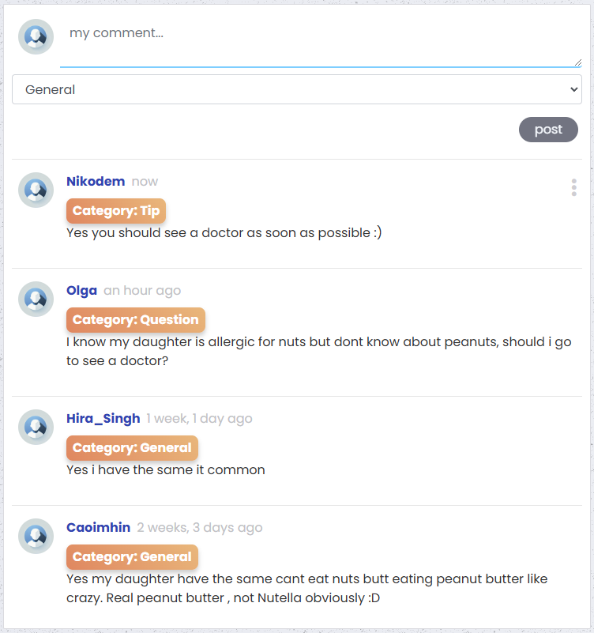
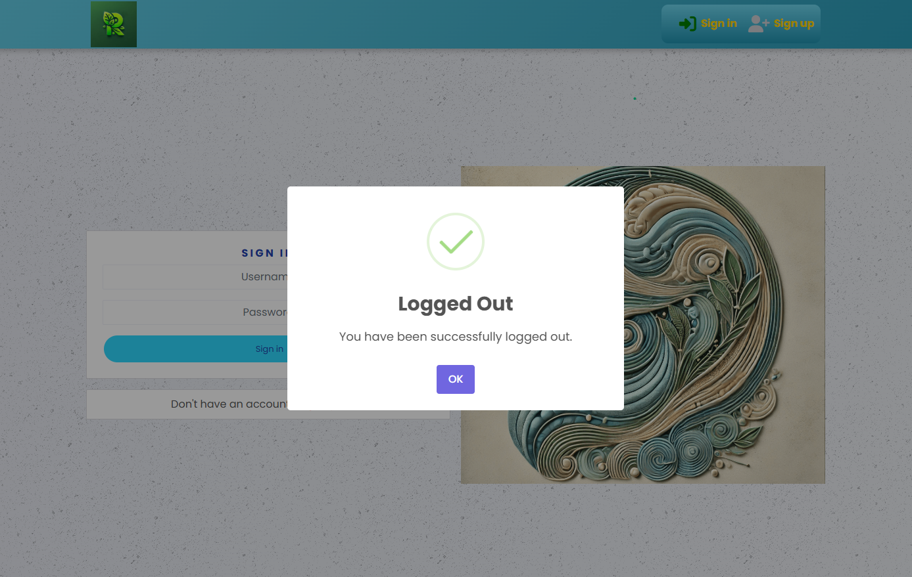

# 🌿 Remeskin - Social Media Platform for Skin Issues and Allergies

[⬆️ Back to Top](#top)

## Table of Contents

- [📘 Introduction](#-introduction)
- [📱 Fully Responsive Design](#-fully-responsive-design)
- [🌟 Features](#-features)
- [🛠️ Technologies](#️-technologies)
- [📱 PWA Support](#-pwa-support)
- [⚙️ Installation and Setup](#️-installation-and-setup)
- [📁 Project Structure](#-project-structure)
- [📋 Project Management](#-project-management)
- [🎨 Design](#-design)
- [🧩 Componenent Documentation](#-component-documentation)
- [🖼️ Screenshots](#️-screenshots)
- [✅ Testing](#-testing)
- [🚀 Frontend Deployment](#-frontend-deployment)
- [🌍 Live Demo](#-live-demo)
- [🔮 Future Plans](#-future-plans)
- [🤝 Contributing](#-contributing)
- [👤 Author](#-author)

## 📘 Introduction
[Remeskin](https://remeskin-00de58d1deef.herokuapp.com/) is a social media platform designed to support individuals dealing with skin conditions like eczema and allergies, including nut allergies. The goal is to create a community where users can share experiences, seek advice, post images of symptoms, and discuss products that help them manage these conditions. Remeskin aims to reduce isolation and helplessness by providing a supportive space for people facing similar challenges.

[⬆️ Back to Top](#top)

## 📱 Fully Responsive Design
Remeskin is designed with a fully responsive layout, ensuring an optimal user experience across various devices and screen sizes, including desktops, tablets, and smartphones.

Below is a visual representation of the platform's responsiveness:


[⬆️ Back to Top](#top)

## 🌟 Features
- **User Registration and Authentication**  
  Users can sign up, log in, and manage their accounts securely.

- **Post Creation and Browsing**  
  Users can create posts, upload photos, and share their experiences. All posts can be liked or followed.

- **Profile Management**  
  Edit profile information, view popular profiles, and manage personal posts.

- **Product Recommendations**  
  Users can recommend products and share experiences with specific skincare and allergy-related products. Each product belongs to a **category** that helps users select appropriate products for their needs.

- **Search and Filter**  
  A powerful search tool with filters to find posts and products.

- **Responsive Design**  
  Optimized for both desktop and mobile devices.

[⬆️ Back to Top](#top)


## 🛠️ Technologies
This project uses the following technologies:

- **React** - JavaScript library for building user interfaces.
- **REST API** - Backend API to manage data interactions.
- **Bootstrap 4.6** - Responsive design and prebuilt styling components.
- **Google Fonts (Lato)** - Clean and modern typography.
- **Font Awesome** - Icons throughout the application.
- **CSS Modules** - Scoped styles for each component.
- **Axios** - For making API requests.
- **SweetAlert2** - For stylish and customizable alert popups.

[⬆️ Back to Top](#top)

## 📱 PWA Support
Remeskin is configured to support installation as a Progressive Web App (PWA). This allows users to install the application on their mobile devices or desktops for a more native app experience. The `manifest.json` file provides metadata for the PWA setup.

[⬆️ Back to Top](#top)

## ⚙️ Installation and Setup
### Prerequisites
- Node.js (v16.0 or later)
- npm (v8.0 or later)
- A modern browser (Chrome, Firefox, Edge)

### Steps to Run Locally
1. Clone the repository:
    ```bash
    git clone https://github.com/Barry1701/remeskin.com.git
    ```

2. Navigate to the project directory:
    ```bash
    cd remeskin.com
    ```

3. Install dependencies:
    ```bash
    npm install
    ```

4. Start the development server:
    ```bash
    npm start
    ```

5. Visit the application at [http://localhost:3000](http://localhost:3000).

[⬆️ Back to Top](#top)

## 📁 Project Structure
- `src/api` - Axios configuration for API calls.
- `src/assets` - Images and static assets.
- `src/components` - Reusable UI components.
- `src/pages` - Feature-specific pages (e.g., auth, posts, profiles).
- `src/styles` - CSS Modules for scoped styling.
- `src/utils` - Helper functions used throughout the app.

[⬆️ Back to Top](#top)

## 📋 Project Management

### Milestones

| Milestone                   | Description                                     | Related User Stories      |
|-----------------------------|-------------------------------------------------|-------------------------  |
| **Core Functionality Implementation**| Implement user registration, login, and logout | #1, #2, #3, #4, #5|
| **Post Features**           | Create, like, and comment on posts             | #11, #12, #14, #15, #16    |
| **Commenting System**       | Add, edit, delete, and view comments           | #19, #20, #21, #22, #23    |
| **User Profile Management** | Manage profile details, posts, and followers   | #24, #25, #26,#27, #28, #29|
| **Product and Category Management**| Add and view product recommendations    | #33, #34, #35, #36         |
| **UX/UI Enhancements**      | Improve design and user experience             | #6, #7, #8, #9, #10        |
| **Final Testing & Deployment** | Ensure full functionality and deployment    | #39, General               |

### MoSCoW Prioritization

#### MUST:
- **Core Functionality Implementation** 
- **Post Features** 
- **User Profile Management**   
- **Comment System**   

#### SHOULD:
- **Product and Category Management** 
- **Search & Filter Features**  
- **Follow User System**   

#### COULD:
- **Improved UX/UI Enhancements** 
- **Final Testing & Deployment** 

>###  **Full List of User Stories**  
>For the complete breakdown of user stories, visit the **[User Stories Board](https://github.com/users/Barry1701/projects/11)**.

[⬆️ Back to Top](#top)

## 🎨 Design

This document outlines the key visual and UX design decisions for **Remeskin**, including color palette, typography, layout structure, and commonly used UI components.

---

### 1. Color Palette

In the CSS files, several repeated color patterns and gradients are used. Below is a consolidated palette:

- **Gradient (Navbar)**  
  - `#6dd5ed` → `#2193b0` (linear gradient)
- **Gradient (Category Labels / “Wow Effect”)**  
  - `#ff7e5f` → `#feb47b`
- **Accent Colors**  
  - **Buttons & Background Variation**: `#242a3d` (dark blue-gray) or `#2142b2` (deep blue)  
  - **Hearts (Liked Posts)**: `#f85032`
- **Base Background** (in `index.css`)  
  - A repeated texture plus a light linear gradient (`#e6e9f0` → `#eef1f5`)
- **Text**  
  - Default: `#333`  
  - Lighter text (e.g., dates): `#c1c1c5` or `#555555`

> **Tip:** If you want to standardize these colors further, consider defining them as CSS variables or SCSS variables.

---

### 2. Typography

- **Primary Font**: [Poppins](https://fonts.google.com/specimen/Poppins) (imported in `index.html`).  
  - Fallback stack: `-apple-system, BlinkMacSystemFont, 'Segoe UI', Roboto, Oxygen, Ubuntu, Cantarell, Fira Sans, Droid Sans, Helvetica Neue, sans-serif`
- **Code Snippets**  
  - `source-code-pro, Menlo, Monaco, Consolas, 'Courier New', monospace`
- **Font Sizes**  
  - Forms, buttons, and general text: typically `14px–16px`  
  - `.Header` class: `16px`, uppercase, letter-spacing  
  - Icons: `i { font-size: 1.6rem }`

Since Bootstrap 4.6 is included, I also inherit its default font sizing (e.g., `<h1>` through `<h6>`).

---

### 3. Icons

- **Font Awesome** is used via a `<script>` in `index.html`.
- Common icons:  
  - Sign-in/out (`fa-sign-in-alt`, `fa-sign-out-alt`), user (`fa-user`, `fa-user-plus`), heart (`fa-heart`), comments (`fa-comments`), etc.
- Additional usage:  
  - **3-dot menu**: `fa-ellipsis-v` (for `<MoreDropdown>`).

---

### 4. Layout & Responsiveness

#### 4.1 Overall Structure

- **Navbar** (fixed, gradient background)  
  - Uses `<Navbar>` from `react-bootstrap` and custom CSS in `NavBar.module.css`.
  - Collapses on mobile, toggled with a custom hook (`useClickOutsideToggle.js`).
- **Main Content**  
  - Wrapped in a `<Container>` with `.Main { padding-top: 81px }` to account for navbar height.
- **Background**  
  - A repeated dark texture plus a linear gradient, set in `body` (see `index.css`).

#### 4.2 CSS Modules & Media Queries

- Each component (e.g., `NavBar`, `Post`, `Comment`) often has its own `.module.css`.
- **Responsive breakpoints** leverage Bootstrap’s defaults (sm, md, lg, xl).
  - For instance, `.d-none d-lg-block` to hide/show elements depending on screen size.

#### 4.3 Common Layout Patterns

- **Two-column layout** on wider screens: main feed (`lg=8`) + sidebar (`lg=4`).
- On smaller viewports, the sidebar is hidden or moved below the main feed.

---

### 5. Core UI Components

1. **Navbar** (`NavBar.js`)
   - Gradient background, sign-in / sign-up links for guests, or user profile links if logged in.
   - `.NavLink` classes control text color, hover transitions, and icons.

2. **Buttons** (various styles in `Button.module.css`)
   - Classes like `.Blue`, `.BlueOutline`, `.Black`, `.BlackOutline`, `.Bright`.
   - Rounded corners (`border-radius: 100px`), hover states that invert colors, etc.

3. **Cards / Posts**
   - Implemented via `<Card>` from `react-bootstrap` + additional styles in `Post.module.css`.
   - Category labels (like “General”, “Eczema”, “Allergy”) have bright gradient backgrounds with hover scaling.

4. **Forms** (Sign in/up, PostCreateForm, ProductCreateForm, etc.)
   - Typically use `<Form>` from `react-bootstrap` plus modular CSS (`SignInUpForm.module.css`, `PostCreateEditForm.module.css`).
   - Validation errors displayed with `<Alert>`.

5. **Alerts / Modals**
   - [SweetAlert2](https://sweetalert2.github.io/) for success/error confirmations.
   - `<Alert>` from `react-bootstrap` for inline messages (e.g., form validation).

6. **Avatars**
   - `Avatar.js` uses `.Avatar` from `Avatar.module.css` to present user images in circular form.

---

### 6. Highlights & Visual Effects

- **Hover States**
  - Navbar: slightly darker gradient on hover.
  - Category chips: color gradient flips, scale effect (`transform: scale(1.05)`).
  - Buttons: background color toggles or inverts.
- **Shadows**
  - Subtle box-shadows on `.Post`, `.ProductCard`, and category labels.

---

### 7. Wireframes

Below are **text-based wireframes** for Remeskin’s main pages, illustrating layout and core elements. Although simplified, they show how content is arranged and where key features appear. 

---

**1. Home Page**

```text
┌───────────────────────────────────────────────────────────────────────────┐
│                               NavBar (fixed)                              │
│  [ Remeskin Logo ] [Add Post] [Home] [Products] [Add Product] [Feed]      │
│        [Liked] [Profile] [Sign Out]   (if logged in)                      │
│        [Sign In] [Sign Up]          (if logged out)                       │
└───────────────────────────────────────────────────────────────────────────┘

┌───────────────────────────────────────────────────────────┬──────────────┐
│ [ Search Bar ] [ Category Filter Dropdown ]               │              │
├───────────────────────────────────────────────────────────┤  Most        │
│  [ PostCard - Title, Content, Image, Category Label ]     │ Followed     │
│  [ Like / Comment icons & counts ]                        │ Profiles     │
│  [ Edit/Delete if owner ]                                 │ (Sidebar)    │
├───────────────────────────────────────────────────────────┤              │
│  [ Another PostCard ... ]                                 │              │
└───────────────────────────────────────────────────────────┴──────────────┘

```

**Description**:

- The NavBar at the top has a gradient background, showing logo and navigation links.  
- The main area (left column) contains a feed of user posts with search and category filters.  
- The right column lists **Most Followed Profiles**.  

---

**2. Sign up Page**

```text
┌───────────────────────────────┐   ┌─────────────────────────────────────┐
│          Sign-Up Form         │   │   Motivational / Personal Image     │
│  [Username]                   │   │   (e.g., child with eczema)         │
│  [Password]                   │   │                                     │
│  [Confirm Password]           │   └─────────────────────────────────────┘
│  [Sign Up Button]             │
│  [Link to Sign In]            │
└───────────────────────────────┘
```

**Description**:

- On the left: a form asking for username, password, and password confirmation.  
- On the right: an image or illustration.  
- After submission, SweetAlert2 shows success/failure.  

---

**3. Sign In Page**

```text
┌───────────────────────────────┐   ┌─────────────────────────────────────┐
│           Sign-In Form        │   │     AI-generated / Artistic Image   │
│  [Username]                   │   │     related to skin/allergies       │
│  [Password]                   │   │                                     │
│  [Sign In Button]             │   └─────────────────────────────────────┘
│  [Link to Sign Up]            │
└───────────────────────────────┘

```

**Description**:

- Similar layout to Sign Up: form on the left, image on the right.  
- Successful login redirects the user to the home/feed page.

---

**4. Profile Page**

```text
┌─────────────────────────────────────────────────────┐
│ [Avatar]   Username                                 │
│  Followers: X   Following: Y    Posts: Z            │
│  [Follow/Unfollow Button] (if not owner)            │
│  [ProfileEditDropdown if owner]                     │
│  Bio: "User’s personal info or description"         │
│                                                     │
└─────────────────────────────────────────────────────┘

┌─────────────────────────────────────────────────────┐
│           [User’s Posts with InfiniteScroll]        │
│  [Post 1]                                           │
│  [Post 2]                                           │
│  ...                                                │
└─────────────────────────────────────────────────────┘

```

**Description**:

- Shows user’s avatar, bio, and stats (number of followers/following/posts).  
- If the profile is owned by the logged-in user, there’s an edit dropdown (to change image, username, password).  
- User’s posts load in an infinite scroll below.  

---

**5. Add Post Page**

```text
┌───────────────────────────────────────────────────────┐
│  [Image Upload Preview or Placeholder]                │
│                                                       │
│  [Title]                                              │
│  [Content (textarea)]                                 │
│  [Category Dropdown: General / Eczema / Allergy ]     │
│                                                       │
│  [Create Button] [Cancel Button]                      │
└───────────────────────────────────────────────────────┘

```

**Description**:

- Form includes fields for a post’s title, content, category, and an optional image.  
- On submit, a SweetAlert2 message confirms success or shows errors.  

---

**6. Product Page**

```text
┌─────────────────────────────────────────────────────────────────┬──────────┐
│ [Search Field] [Category Filter for Products]                   │          │
│-----------------------------------------------------------------│ Popular  │
│ [ProductCard: Title, Description, Image, Category Label]        │Profiles  │
│ [ Edit/Delete if owner ]                                        │(Sidebar) │
│-----------------------------------------------------------------│          │
│ [ Another ProductCard ... ]                                     │          │
└─────────────────────────────────────────────────────────────────┴──────────┘

```

**Description**:

- Shows a list of community-recommended products, each with a category label.  
- Users can search products by name and filter by category.  
- Owners can edit or delete their own product entries.  


---


[⬆️ Back to Top](#top)

## 🧩 Component Documentation

Below is an overview of key **reusable components** used in Remeskin. Each entry describes the component’s **purpose**, **props**, **styling**, **usage examples**, and **additional notes** on testing or edge cases.

---

### 1. `NavBar` (src/components/NavBar.js)

**Purpose**  
- Displays a responsive navigation bar at the top of the application.
- Shows different links and icons depending on whether the user is logged in (`currentUser` state) or logged out.

**Props**  
- *No direct props passed in*; instead, it relies on:
  - `useCurrentUser()` to check authentication status and display user-specific links.
  - `useSetCurrentUser()` to handle logouts.

**Styling**  
- Uses [React Bootstrap’s Navbar](https://react-bootstrap.github.io/components/navbar/) under the hood.  
- Has **custom gradient** (`NavBar.module.css`), with hover effects that slightly darken the gradient.

**Usage Example**

```jsx
import NavBar from "./components/NavBar";

function App() {
  return (
    <div>
      <NavBar />
      {/* Other routes and components here */}
    </div>
  );
}

export default App;

```

**Edge Cases & Testing**:

- **Logged-out state**: Check that Sign In / Sign Up links appear, and that restricted links (like Add Post) are hidden.  
- **Logged-in state**: Ensure user-specific links (Profile, Sign Out) appear correctly. Test the sign-out flow (e.g., error handling if the logout fails).

### 2. `Avatar` (src/components/Avatar.js)

**Purpose**  
- Renders a circular user avatar (profile image) at a specified size.  
- Optional text can appear to the right of the avatar.

**Props**  
- `src` (**string**, required): The image URL for the avatar.  
- `height` (**number**, default=45): The avatar’s rendered size, used for both width and height.  
- `text` (**string | JSX**, optional): If provided, appears inline with the avatar image.

**Styling**  
- Controlled by `Avatar.module.css`, using:
  - `border-radius: 50%` for the circle.
  - `object-fit: cover` to ensure the image is neatly cropped.

```jsx

import Avatar from "./components/Avatar";

function ProfileBadge() {
  return (
    <div>
      <Avatar src="/images/profile.jpg" height={60} text="MyUserName" />
    </div>
  );
}

```

**Edge Cases & Testing:**

- **Broken image URL:** The default behavior is to show a broken image icon if `src` is invalid. Consider adding an `onError` fallback if desired.
- **Long text:** If text is lengthy, ensure it wraps or truncates correctly in small layouts.

### 3. `MoreDropdown` (src/components/MoreDropdown.js)

**Purpose**
- Renders a three-dot “options” dropdown (using `<Dropdown>` from react-bootstrap).
- Typically used to display quick actions (e.g., **Edit / Delete**) on posts, comments, or profiles.

**Props**
- **`handleEdit`** *(function, optional)*: Called when the user selects **“Edit”**.
- **`handleDelete`** *(function, optional)*: Called when the user selects **“Delete”**.

**Styling**
- `.DropdownItem` classes in **MoreDropdown.module.css** minimize padding and customize alignment.
- By default, the dropdown is positioned to the left (`drop="left"`), which can be changed if needed.

**Usage Example**

```jsx

import { MoreDropdown } from "../components/MoreDropdown";

function PostActions({ onEdit, onDelete }) {
  return (
    <MoreDropdown handleEdit={onEdit} handleDelete={onDelete} />
  );
}

```

**Edge Cases & Testing**

- **No `handleEdit` or `handleDelete`**: The menu still appears, but selecting an action may do nothing.
- **Position conflicts**: In narrow layouts, `drop="left"` might cause the menu to extend off-screen. Verify on mobile.

### 4. `ProfileEditDropdown` (src/components/MoreDropdown.js)

**Purpose**
- A specialized variant of **MoreDropdown** for editing user profiles (**Edit Profile, Change Username, Change Password**).

**Props**
- **`id`** *(number, required)*: The profile ID used to build edit links.

**Styling & Usage**
- Similar to **MoreDropdown**, but includes unique menu items relevant to profile editing.

**Example Usage in `ProfilePage.js`**:

```jsx

{profile?.is_owner && <ProfileEditDropdown id={profile?.id} />}

```

**Edge Cases**

- Must ensure the logged-in user actually **“owns”** that profile.
- If the user navigates to these routes manually without permissions, handle server rejections (**401/403**).

### 5. `Asset` (src/components/Asset.js)

**Purpose**
- Shows either (or both) a **loading spinner** and an **image**, with optional text.
- Commonly used to display **loading states** or **no-results placeholders**.

**Props**
- **`spinner`** *(boolean, optional)*: If `true`, renders a `<Spinner animation="border" />`.
- **`src`** *(string, optional)*: A URL for a placeholder image.
- **`message`** *(string, optional)*: Text displayed below the spinner/image.

**Styling**
- **Asset.module.css** uses a **flex container** to center content.
- The spinner is from **react-bootstrap’s** `<Spinner>`.

**Usage Example**

```jsx

function LoadingExample() {
  return (
    <Asset spinner message="Fetching data..." />
  );
}

function NotFoundExample() {
  return (
    <Asset src="/images/no_results.png" message="No results found." />
  );
}

```

**Edge Cases & Testing**

- **Both `spinner` and `src`**: The component shows both the spinner and the image. Confirm layout is okay.
- **No props**: Renders an empty container if neither `spinner` nor `src` are provided.

### 6. `NotFound` (src/components/NotFound.js)

**Purpose**

- A simple **fallback component** indicating that a page or resource **does not exist** (**404-like message**).
- Often rendered when a **Route isn’t matched** or a **resource is missing**.

**Props**

- **None**

**Styling**

- Uses **NotFound.module.css**, which centers the message and an optional image.
- Internally imports the **Asset** component with a default message like:
  > *"Sorry, the page you're looking for doesn't exist."*

**Usage Example**

```jsx

import NotFound from "../components/NotFound";

function SomeRoutingComponent() {
  // ...
  <Route render={() => <NotFound />} />
}

```

**Edge Cases & Testing**

- **Conditional**: You could also show `<NotFound />` if a specific resource (**post, user, etc.**) wasn’t found by the API.
- **Custom messages**: If you want dynamic content, pass a prop or use your own logic. Currently, it's static.

### 7. `Form Components` (e.g., SignInForm, SignUpForm)

While these forms are more **feature-specific** than truly **reusable**, you may still want to document them briefly if multiple parts of the application share these patterns.

**Purpose**

- Each form handles a **unique user flow** (**sign in, sign up, etc.**).
- They often integrate **SweetAlert2** for **success/error feedback**.

**Notable Details**

- Usually rely on **axios.post()** calls (e.g., `POST /dj-rest-auth/login/`) and **context state updates** (`useSetCurrentUser`).
- Use **react-bootstrap** components:
  - `<Form>` for structured input fields.
  - `<Alert>` for validation/error messages.
  - `<Button>` for submission.

**Usage**

- Typically used as **pages**:

  ```jsx
  <Route path="/signup" element={<SignUpForm />} />

  ```

### `Final Thoughts on Components`

These component descriptions reflect the primary reusable elements of Remeskin. My goal is to provide clear guidance on their usage, styling, and potential edge cases so that future contributors or reviewers can quickly understand how each part of the UI is constructed. 

As the application grows, here are a few important points to keep in mind:

1. **Maintain Accuracy** – Whenever new props are introduced or existing ones change, updating this documentation helps prevent confusion among collaborators.  
2. **Visual Demonstrations** – Tools such as [Storybook](https://storybook.js.org/) can illustrate component variations and states in a more visual, interactive manner.  
3. **Testing** – Adding both unit and integration tests ensures that each component behaves as intended and reduces the risk of regressions when making updates or adding new features.

By following these guidelines, I aim to keep the codebase well-structured and user-friendly for anyone who may work on or evaluate this project in the future.

[⬆️ Back to Top](#top)

---

## 🖼️ Screenshots
Below are screenshots showcasing key features and elements of the Remeskin platform. Each screenshot includes a detailed description to help users understand the functionality and design of the application.

### 🖼️ Navigation Bar (Logged-Out View)
This screenshot displays the navigation bar visible to users who are not logged in or registered.

- On the left side, the **Remeskin logo** is displayed for branding purposes. The logo was designed and generated using Canva.
- On the right side, there are two main options:
  - **Sign In** button, represented by a login icon, allowing existing users to log into their accounts.
  - **Sign Up** button, represented by a user icon, enabling new users to register for the platform.

The navigation bar features a clean and minimalist design with a blue gradient background, ensuring good contrast and readability.


### 🖼️ Sign-Up Page
This screenshot displays the **Sign-Up Page** of the Remeskin platform, where new users can create an account.

- On the **left side**, there is a registration form that includes fields for:
  - **Username**
  - **Password**
  - **Confirm Password**
  - A "Sign Up" button to submit the form.
  - A link at the bottom of the form for users who already have an account to navigate to the **Sign-In Page**.

- On the **right side**, there is a photo of the author's son, who has been managing eczema and a nut allergy since birth. This personal element highlights the inspiration and motivation behind creating the platform.


### 🖼️ Sign-In Page
This screenshot displays the **Sign-In Page** of the Remeskin platform, allowing existing users to access their accounts.

- On the **left side**, there is a login form that includes fields for:
  - **Username**
  - **Password**
  - A "Sign In" button to submit the form.
  - A link at the bottom of the form for users who don't have an account to navigate to the **Sign-Up Page**.

- On the **right side**, there is an artistic image of a profile with intricate, nature-inspired patterns. This image was designed by author and generated using AI tools, adding a modern and creative touch to the page while aligning with the theme of individuality and natural solutions.


### 🖼️ Navigation Bar (Logged-In View)
This screenshot displays the **Navigation Bar** visible to logged-in users on the Remeskin platform.

- **Left side**:
  - The **Remeskin logo**, is displayed on the left side and is linked to the homepage, allowing users to quickly return to the main feed.

- **Center section**:
  - **Add Post** button: Allows users to create a new post.
  - **Home** button: Navigates users to the main feed.
  - **Products** button: Directs users to browse or view product recommendations.
  - **Add Product** button: Provides an option for users to recommend a product.
  - **Feed** button: Links to the personalized feed of posts.
  - **Liked** button: Displays posts the user has liked.

- **Right side**:
  - **Profile** button: Navigates to the user's profile page.
  - **Sign Out** button: Logs the user out of the platform.

The navigation bar maintains a clean design with a blue gradient background, ensuring usability and readability for users.


### 🖼️ Home Page
This screenshot displays the **Home Page** of the Remeskin platform, where users can browse posts and interact with the community.

- **Search Bar**: Positioned at the top, allowing users to search for specific posts by keywords.
- **Category Filter**: Located below the search bar, providing a dropdown menu to filter posts by specific categories.
- **Post Section**:
  - Displays a post by the user **Nikodem** with the title **"Nuts and Peanuts"**.
  - The post describes a personal experience about nut allergies, highlighting the user's ability to eat peanuts despite a tree nut allergy. This encourages engagement with others who may relate.
  - Includes a **category label** ("Allergy") displayed below the content, making it easy to identify the post's context.
  - Interaction options include **like** and **comment** buttons, showing engagement metrics (e.g., 4 likes and 3 comments).
  - A **three dots menu** next to the post date provides options to update or delete the post (visible to the post owner only).
- **Most Followed Profiles**: Displayed on the right side, showcasing a list of the most followed profiles on the platform. Each profile card includes:
  - **Username** and profile icon.
  - A button to either **follow** or **unfollow** the user.

This page provides a user-friendly interface for discovering posts, interacting with the community, and managing connections on the platform.


### 🖼️ Add Post Page with Category Dropdown
This screenshot displays the **Add Post Page** of the Remeskin platform, where users can create and upload new posts. It highlights the **Category Dropdown** functionality.

- **Image Upload Section**:
  - A clickable area to upload an image. The placeholder includes an upload icon and a label: **"Click or tap to upload an image"**.

- **Form Fields**:
  - **Title**: A text input field for adding a title to the post.
  - **Content**: A larger text area for entering the content of the post, such as a description or details about the shared experience.
  - **Category Dropdown**: A dropdown menu allowing users to select a category for the post. Available categories include:
    - **General**
    - **Eczema**
    - **Allergy**

- **Buttons**:
  - **Cancel**: Allows users to discard the post creation process.
  - **Create**: Submits the post to the platform.

This page provides an intuitive interface for users to categorize their posts effectively, improving organization and discoverability within the community.


### 🖼️ Comments Section with Categories
This screenshot showcases the **Comments Section** on the Remeskin platform, allowing users to interact and categorize their comments for better context and readability.

- **Comment Input**:
  - A text input field where users can type their comments.
  - **Category Dropdown**: Allows users to assign a category to their comment. Available options include:
    - **General**
    - **Question**
    - **Tip**
  - **Post Button**: Submits the comment to the discussion.

- **Example Comments**:
  - **Nikodem** (Category: Tip): Offers advice to see a doctor as soon as possible.
  - **Olga** (Category: Question): Asks a question about nut allergies and whether to consult a doctor.
  - **Hira_Singh** (Category: General): Shares that they have experienced something similar.
  - **Caoimhin** (Category: General): Discusses their child's similar experience with nuts and mentions peanut butter.

This section enhances engagement by allowing users to categorize their contributions, making discussions more organized and valuable to the community.




### 🖼️ Product Page Example
This screenshot displays an example from the **Product Page** of the Remeskin platform, where users can explore recommended products shared by the community.

- **Search and Filter**:
  - **Search Bar**: Located at the top, allowing users to search for specific products.
  - **Category Filter**: Below the search bar, providing a dropdown menu to filter products by categories.

- **Product Section**:
  - **Product Title**: The featured product is **"Vesgantti Single Mattress"**.
  - **Product Content**:
    - A testimonial from the user highlights the product's effectiveness in improving comfort and sleep quality for their child with sensitive skin. The description emphasizes the product's ability to reduce scratching and promote peaceful sleep.
    - The **category label** ("Hypoallergenic Clothing and Bedding") is prominently displayed below the description for clarity.
  - **Default Product Image**:
    - The image shown is the default product representation, designed by the author and generated using AI tools, maintaining a clean and professional aesthetic.

- **Most Followed Profiles**:
  - Displayed on the right side, showcasing a list of the most followed profiles on the platform. Each profile includes:
    - **Username** and profile picture.
    - A **follow/unfollow button** to manage connections.

This page provides users with a well-organized and user-friendly interface to explore and share product recommendations for skin and allergy-related challenges.


### 🖼️ Add Product Page
This screenshot displays the **Add Product Page** of the Remeskin platform, where users can recommend and share skincare or allergy-related products.

- **Image Upload Section**:
  - A clickable area to upload an image of the product. .
  
- **Form Fields**:
  - **Name**: A text input field for entering the name of the product.
  - **Description**: A larger text area for adding details about the product, such as its benefits or usage.
  - **Category Dropdown**: A dropdown menu to select a category that best describes the product.

- **Buttons**:
  - **Cancel**: Allows users to discard the current product submission process.
  - **Create**: Submits the new product to the platform.

This page is designed to provide an intuitive interface for users to add detailed and categorized product recommendations.


### 🖼️ Feed Page Example
This screenshot displays a **Feed Page** example from the Remeskin platform, where users can view posts shared by the profiles they follow.

- **Search and Filter**:
  - **Search Bar**: Positioned at the top, allowing users to search for posts using keywords.
  - **Category Filter**: Below the search bar, providing a dropdown menu to filter posts by categories.

- **Post Section**:
  - **Post Author**: The post is created by **Bartosz**, with the posting date displayed (**27 Dec 2024**).
  - **Post Content**:
    - A featured image showcasing skincare products and natural elements, emphasizing the platform's focus on holistic skin health and natural remedies.
    - Text content encouraging community members to share tips, habits, or products that have helped them with skin issues and allergies. Examples include:
      - A soothing cream.
      - An allergen-free snack.
      - A daily routine to prevent flare-ups.
    - The post motivates users to provide advice and foster community support.
    - A **category label** ("General") is prominently displayed below the text to identify the context of the post.
  - **Engagement Options**:
    - Users can interact with the post using **like** and **comment** buttons. Engagement metrics (4 likes, 6 comments) are displayed below the post.

This page fosters a personalized and engaging space for users to connect with posts from their network and gain valuable insights shared by the community.


### 🖼️ Liked Posts Page Example
This screenshot displays an example of the **Liked Posts Page** on the Remeskin platform, showcasing posts that the user has liked.

- **Search and Filter**:
  - **Search Bar**: Positioned at the top, allowing users to search through liked posts using keywords.
  - **Category Filter**: Below the search bar, providing a dropdown menu to filter liked posts by categories.

- **Post Section**:
  - **Post Author**: The post is created by **Saoirse28**, with the posting date displayed (**27 Dec 2024**).
  - **Post Content**:
    - A captivating featured image of a serene sunset over a reflective body of water, symbolizing tranquility and hope.
    - Text content titled **"Strength in Every Step"**, emphasizing perseverance and shared experiences. The message inspires users with motivational words:
      - "Healing is a journey, not a race. Every small step forward is progress."
      - Encourages users to find strength in community and shared stories.
    - A **category label** ("General") is prominently displayed below the text, making it easy to identify the post's context.
  - **Engagement Metrics**:
    - Displays **1 like** (liked by the user) and **0 comments**.

This page provides users with a personalized and uplifting space to revisit posts they have liked, helping them reconnect with inspiring and valuable content shared by the community.


### 🖼️ Profile Page Example
This screenshot displays an example of the **Profile Page** on the Remeskin platform, where users can view and manage their personal profile and posts.

- **Profile Information**:
  - **Profile Picture**: A circular avatar representing the user (**Katarzyna**).
  - **Username**: Displayed prominently at the top of the profile.
  - **Statistics**:
    - **1 Post** created by the user.
    - **10 Followers** who follow Katarzyna.
    - **6 Following**, showing the number of users Katarzyna follows.
  - **User Bio**: A short description: *"Hi, I'm Kate and I'm 40."*
  - **Allergy Type**: Clearly displayed as **Milk Allergy**, indicating a specific condition relevant to the community.
  - **Three-Dots Menu (⋮)**:
    - Users can click on the three-dots menu to access additional profile management options:
      - **Edit Profile**: Allows users to update their bio, profile picture, or other personal details.
      - **Change Username**: Provides an option to modify the displayed username.
      - **Change Password**: Enables users to securely update their account password.

- **User's Posts**:
  - A post dated **09 Feb 2025**, containing an image of the back of a child's head with visible redness, likely related to an allergic reaction or skin condition.
  - The post provides a space for discussion, support, and advice from the community.

- **Most Followed Profiles**:
  - Displayed on the right side, showing a list of the most followed profiles on the platform.
  - Each profile includes:
    - **Username** and profile picture.
    - A **follow/unfollow button** to manage connections.
  - Katarzyna’s profile is also visible in this section with her avatar.

This page provides a structured and user-friendly layout, enabling individuals to share their experiences, track engagement, and connect with others facing similar challenges.


### 🖼️ Edit Profile Page Example
This screenshot displays the **Edit Profile Page** on the Remeskin platform, where users can update their profile details.

- **Profile Picture**:
  - Users can change their profile picture by clicking the **"Change the image"** button below the avatar.
  - The default profile image is designed to match the platform’s aesthetic.

- **Profile Fields**:
  - **Name**: Users can update their displayed name.
  - **Bio**: A text area where users can write a short personal description.

- **Allergy Type Selection**:
  - A dropdown menu allowing users to specify their allergy type.
  - Available options include:
    - **No Specific Allergy**
    - **Milk Allergy**
    - **Nut Allergy**
    - **Wheat Allergy**
    - **Egg Allergy**
    - **Shellfish Allergy**
  - This feature helps personalize the user profile and connects individuals facing similar health challenges.

This page provides a clean and user-friendly interface, allowing users to customize their profile and enhance community engagement.


### 🖼️ SweetAlert Notifications

This screenshot showcases a **SweetAlert notification** that appears when a user successfully logs out of the Remeskin platform.

- **Message**: "Logged Out - You have been successfully logged out."
- **Icon**: A green checkmark indicating a successful action.
- **Button**: A single **OK** button to close the notification.

This alert provides clear feedback to the user about the success of their logout action.



This screenshot displays a **SweetAlert confirmation modal** that appears when a user attempts to delete a post.

- **Message**: "Are you sure? - You won't be able to undo this!"
- **Icon**: A warning icon (yellow exclamation mark) indicating a potentially irreversible action.
- **Buttons**:
  - **Yes, delete it!**: Proceeds with deleting the post.
  - **Cancel**: Cancels the deletion process.

This alert ensures that users are aware of the consequences before performing a critical action.


This screenshot shows a **SweetAlert error notification** that appears when an action fails (e.g., updating a password).

- **Message**: "Error! - Failed to update the password. Please try again."
- **Icon**: A red cross indicating an error.
- **Button**: A single **OK** button to close the notification.

This alert provides immediate feedback about an issue, guiding the user to retry or address the problem.


[⬆️ Back to Top](#top)

## ✅ Testing

#### 🛠️ Manual Testing
- The application was manually tested to ensure all core functionalities work as expected across different devices and screen sizes.
- Key manual test cases included:
  - User registration and login flows.
  - Adding, editing, and deleting posts.
  - Searching and filtering posts and products.
  - Responsiveness on desktop, tablet, and mobile devices.
  - Interaction with SweetAlert notifications for success, error, and confirmation messages.

#### 🌟 Lighthouse Report
The application was tested using **Lighthouse** to evaluate its performance, accessibility, best practices, and SEO. Below are the results:

| Metric             | Score |
|--------------------|-------|
| **Performance**    | 91    |
| **Accessibility**  | 88    |
| **Best Practices** | 96    |
| **SEO**            | 92    |

**Performance Breakdown**:
- **First Contentful Paint**: 0.7s
- **Largest Contentful Paint**: 2.0s
- **Total Blocking Time**: 0ms
- **Cumulative Layout Shift**: 0.001


These scores reflect a well-optimized and user-friendly application, ensuring a seamless experience for users.


#### 🌐 Browser Compatibility
- The application was tested on the following browsers:
  - Google Chrome
  - Mozilla Firefox
  - Microsoft Edge

#### 🧪 Automated Testing

This project uses **Jest** and **React Testing Library** for automated testing. We have implemented the following test suites to ensure that key components work as expected:

- **NavBar.test.js**  
  *Tests the navigation bar component.*  
  - Verifies that when the user is logged out, the **Sign In** and **Sign Up** links are displayed and the **Sign Out** link is hidden.  
  - Checks that when a user is logged in, the **Profile** and **Sign Out** links are shown, while **Sign In** and **Sign Up** are hidden.
  
- **Post.test.js**  
  *Tests the Post component.*  
  - Ensures that post details (title, content, category) are rendered correctly.  
  - Simulates a non-owner user liking the post and verifies that the like action triggers an API call and updates the state.  
  - Checks that if the logged-in user is the owner of the post, the like action is disabled (a tooltip with the message "You can't like your own post!" is shown).

- **NotFound.test.js**  
  *Tests the NotFound component.*  
  - Confirms that the component renders a fallback message (e.g., "Sorry, the page you're looking for doesn't exist") and displays an image.

- **Avatar.test.js**  
  *Tests the Avatar component.*  
  - Validates that the avatar image is rendered with the correct source (`src`), height, and that accompanying text is displayed if provided.

### Running Automated Tests

To run the tests, execute the following command in your terminal:

```bash
npm test

```

[⬆️ Back to Top](#top)

## 🚀 Frontend Deployment

### Hosting Platform
- The frontend of the **Remeskin** platform is hosted on **Heroku**.

### Deployment Process
To deploy the frontend, follow these steps:

1. **Build the Application**:
   - Ensure all dependencies are installed by running:
     ```bash
     npm install
     ```
   - Create a production-ready build using:
     ```bash
     npm run build
     ```
   - This command generates an optimized build in the `build/` folder.

2. **Create a Heroku App**:
   - Log in to Heroku using:
     ```bash
     heroku login
     ```
   - Create a new Heroku application:
     ```bash
     heroku create remeskin-frontend
     ```

3. **Configure Heroku for Static File Hosting**:
   - Add a `static.json` file in the root directory with the following content:
     ```json
     {
       "root": "build/"
     }
     ```
   - This tells Heroku to serve static files from the `build/` folder.

4. **Add Buildpacks**:
   - Configure Heroku buildpacks for React apps:
     ```bash
     heroku buildpacks:set mars/create-react-app
     ```

5. **Deploy to Heroku**:
   - Initialize a Git repository (if not already initialized):
     ```bash
     git init
     ```
   - Add all files and commit:
     ```bash
     git add .
     git commit -m "Deploy frontend to Heroku"
     ```
   - Push the code to Heroku:
     ```bash
     git push heroku main
     ```

6. **Set Environment Variables**:
   - Set the environment variable for the backend API URL:
     ```bash
     heroku config:set REACT_APP_API_URL=<your-backend-api-url>
     ```

7. **Verify Deployment**:
   - Visit the live frontend application at the URL provided by Heroku.

### Environment Variables
- **REACT_APP_API_URL**: URL for the backend API (e.g., `https://drestf-api-8914bba56128.herokuapp.com/`).

### Continuous Deployment
- **GitHub Integration**:
  - Connect the Heroku app to the GitHub repository for automatic deployment whenever changes are pushed to the main branch.
  - Set up the deployment pipeline in the **Heroku Dashboard** under the "Deploy" tab.

[⬆️ Back to Top](#top)

## 🌍 Live Demo
 - Check out the live version of Remeskin: [https://remeskin-00de58d1deef.herokuapp.com/](https://remeskin-00de58d1deef.herokuapp.com/).

[⬆️ Back to Top](#top)

## 🔮 Future Plans
- **Resources from dermatologists and allergy specialists**  
  Provide curated content and professional advice to help users manage their skin conditions and allergies more effectively.

- **Group discussions and expert Q&A forums**  
  Enable community members to connect, share experiences, and ask questions in real-time discussions or through sessions with specialists.

- **Multilingual support**  
  Make the platform accessible to a global audience by supporting multiple languages, ensuring inclusivity and wider reach.

- **Short video uploads**  
  Users can share short videos (e.g., 30 seconds) to better illustrate their symptoms, experiences, or product reviews, fostering a more engaging and informative community.

[⬆️ Back to Top](#top)

## 🤝 Contributing
We welcome contributions! To get started:

1. Fork the repository.

2. Create a new branch:
    ```bash
    git checkout -b feature-name
    ```
3. Commit your changes:
    ```bash
    git commit -m "Add feature"
    ```
4. Push to the branch:
    ```bash
    git push origin feature-name
    ```
5. Open a pull request.

[⬆️ Back to Top](#top)

## 👤 Author
**Bartosz Stanczuk** - Developer and creator of Remeskin.

[⬆️ Back to Top](#top)


