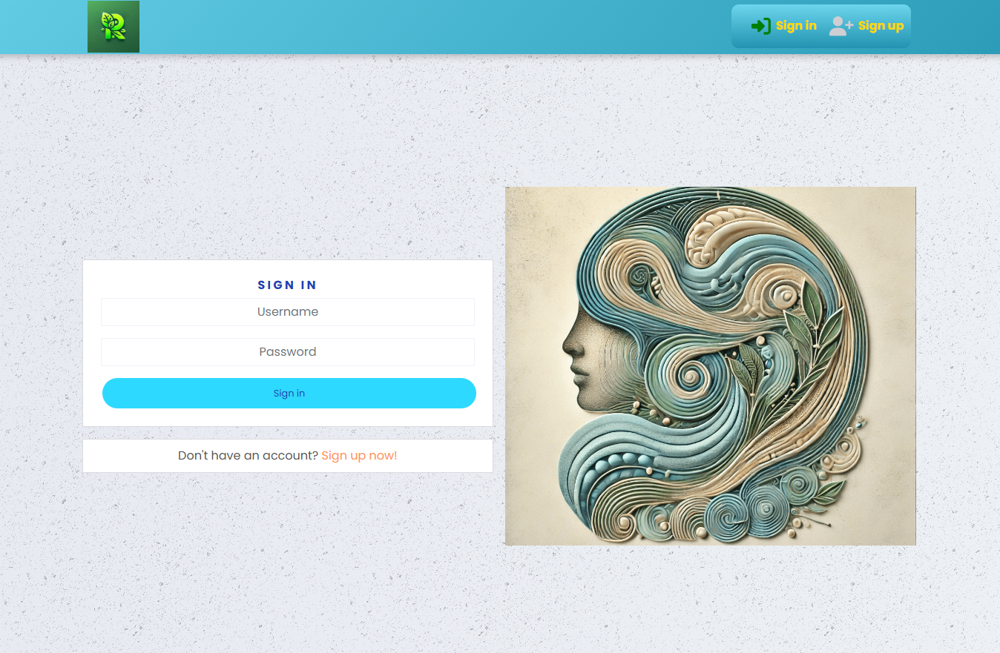

# 🌿 Remeskin - Social Media Platform for Skin Issues and Allergies

## 📘 Introduction
[Remeskin](https://remeskin-00de58d1deef.herokuapp.com/) is a social media platform designed to support individuals dealing with skin conditions like eczema and allergies, including nut allergies. The goal is to create a community where users can share experiences, seek advice, post images of symptoms, and discuss products that help them manage these conditions. Remeskin aims to reduce isolation and helplessness by providing a supportive space for people facing similar challenges.

## 💻 Technologies
This project uses the following technologies:
- **React** - JavaScript library for building user interfaces
- **REST API** - Backend API to manage data interactions
- **CSS Modules** - Scoped styles for each component
- **Axios** - For API requests

## ⚙️ Installation and Setup
To run this project locally, follow these steps:

1. Clone the repository:
    ```bash
    git clone https://github.com/Barry1701/remeskin.com.git

    ```

2. Navigate to the project directory:
    ```bash
    cd remeskin.com
    
    ```

3. Install dependencies:
    ```bash
    npm install
    
    ```

4. Start the development server:
    ```bash
    npm start

    ```

5. The app should now be running on http://localhost:3000

📁 Project Structure
- `src/api` - Contains axios configuration for interacting with the backend API.
- `src/assets` - Stores images used across the application.
- `src/components` - Includes main reusable UI components.
- `src/pages` - Pages grouped by feature (e.g., auth, comments, posts, products, profiles).
- `src/styles` - CSS Modules for styling individual components.
- `src/utils` - Helper functions used throughout the application.

✨ Features
- **User Registration and Authentication** - Users can sign up and log in.
- **Post Creation and Browsing** - Users can create posts, view recent posts, and like/follow posts.
- **Profile Management** - Users can edit their profile information, view popular profiles, and manage their posts.
- **Product Recommendations** - Users can recommend products and share experiences with specific skincare and allergy-related products. Each product belongs to a **category** that helps users select appropriate products for their needs.
- **Search and Filter** - Users can search for posts and filter them based on criteria.


🌐 Live Demo  
Check out the live version of Remeskin: 🌐 [https://remeskin-00de58d1deef.herokuapp.com/](https://remeskin-00de58d1deef.herokuapp.com/) _(opens in a new tab)_

🖼️ Screenshots

Below are some screenshots showcasing key features of the Remeskin platform. All images are stored in the `documentation` folder.

- **Post Creation**: The form for creating a new post, where users can upload an image, enter a title, and add content.
  

- **Product Creation**: The form for adding a new product recommendation, with fields for uploading an image, entering the product name, description, and selecting a category.
  

- **Sign In Page**: The sign-in interface where users can enter their credentials to log in.
  

- **Sign Up Page**: The sign-up interface where new users can create an account by providing a username, password, and confirming the password.
  

- **Navigation Bar**: The top navigation bar, displaying links to Home, Products, Sign In, and Sign Up, along with the Remeskin logo.
  

- **Collapsed Menu**: The navigation bar for smaller screen in its collapsed form, showing icons and labels for quick access.
  

🔮 Future Plans
Some potential future enhancements for Remeskin include:

- Adding resources from dermatologists and allergy specialists
- Expanding community features, such as group discussions or expert Q&A
- Implementing advanced filtering options for posts and products

## 📜 Credits

- This project was inspired by the **Moments** project, which provided a foundation for the structure and functionality of Remeskin.
- The **signup page** includes a personal photo of the developer's son, who has been managing a nut allergy and eczema since birth.
- The **logo**, **favicon**, and **signup images** are original creations generated using an image generator.


👤 Authors
- **Bartosz Stanczuk** - Developer and creator of Remeskin


   